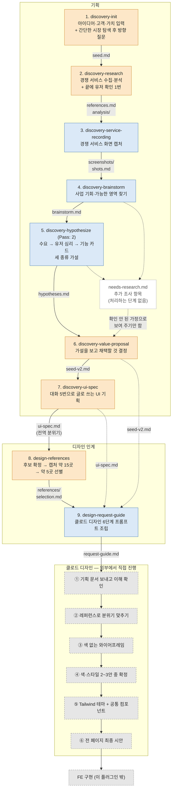

# dk-discovery-bundle

서비스 아이디어 한 줄에서 시작해 경쟁 조사, 가설, 가치 기획, UI 기획을 거쳐, 클로드 디자인에 넘길 레퍼런스와 진행 가이드까지 만드는 Claude Code 플러그인이다.
기획 단계 7개와 디자인 인계 단계 2개, 모두 9개의 스킬이 들어 있다.

## 설치

```
/plugin marketplace add https://github.com/dkGithup2022/dk-discovery-bundle.git
/plugin install dk-discovery-bundle@dk-discovery-bundle
```

설치하면 `/dk-discovery-bundle:discovery-init`처럼 호출한다. 스킬 목록은 아래 "스킬 목록" 표에 있다.

필요한 도구:
- WebSearch, WebFetch — 경쟁 서비스 조사 (`discovery-init`, `discovery-research`)
- Playwright MCP — 화면 캡처 (`discovery-service-recording`, `design-references`)
- git — 단계마다 산출물을 커밋한다. 작업하는 프로젝트가 git 저장소여야 한다.

## 폴더 구성

| 폴더 | 내용 |
|---|---|
| `skills/` | 스킬 9개의 진입점 (`SKILL.md`) |
| `project_discovery/` | 기획 스킬들이 읽는 문서 — 단계별 워크플로, 문체 규칙, 도구 사용법, git 규칙, 조사 반복 규칙 |
| `cc_design_handoff/` | 디자인 인계 스킬들이 읽는 문서 — 워크플로, 캡처 규칙, 문체 규칙, git 규칙 |
| `examples/` | 단계마다 실제 실행에서 무엇이 들어가고 무엇이 나왔는지 발췌한 문서 |

## 스킬 목록

| # | 스킬 | 하는 일 | 유저 참여 | 실행 예시 |
|---|---|---|---|---|
| 1 | `discovery-init` | 아이디어·고객·가치로 출발점 문서(seed.md) 만들기 | 입력 + 방향 질문 | [보기](examples/discovery-init/input-output.md) |
| 2 | `discovery-research` | 경쟁 서비스 찾고 분석하기 | 끝에 확인 1번 | [보기](examples/discovery-research/input-output.md) |
| 3 | `discovery-service-recording` | 경쟁 서비스 화면 캡처하기 | 없음 | [보기](examples/discovery-service-recording/input-output.md) |
| 4 | `discovery-brainstorm` | 사업 기회와 가능한 영역 찾기 | 없음 | [보기](examples/discovery-brainstorm/input-output.md) |
| 5 | `discovery-hypothesize` | 세 종류 가설 세우기 (`Pass: 2`로 실행) | 없음 | [보기](examples/discovery-hypothesize/input-output.md) |
| 6 | `discovery-value-proposal` | 가설을 보고 채택할 것 정하기 (seed-v2.md) | 결정 대화 | [보기](examples/discovery-value-proposal/input-output.md) |
| 7 | `discovery-ui-spec` | 대화 5번으로 글로 쓰는 UI 기획 (ui-spec.md) | 대화 5번 | [보기](examples/discovery-ui-spec/input-output.md) |
| 8 | `design-references` | 톤 레퍼런스 캡처하고 보낼 곳 고르기 | 후보 확정 + 선별 | [보기](examples/design-references/input-output.md) |
| 9 | `design-request-guide` | 클로드 디자인 6단계 진행 가이드 만들기 | 없음 | [보기](examples/design-request-guide/input-output.md) |

실행 예시는 모두 "크루 매거진 커뮤니티 앱" 아이디어로 한 번 끝까지 돌린 결과에서 발췌했다.

모든 산출물은 **작업 중인 프로젝트**에서 실행 한 번마다 `discovery/{날짜-시각-서비스이름}/` 아래에 단계별 폴더로 쌓인다.
각 단계는 끝날 때 git 커밋 하나를 남긴다. 기획 단계는 `discovery(...)`, 디자인 단계는 `design(...)`로 시작한다.
각 단계의 `handoff.json`에는 다음에 실행할 단계(`next_step`)가 적혀 있다.

---

## 흐름도



색 구분: 주황은 유저와 대화하는 단계, 파랑은 자동으로 도는 단계, 회색 점선은 스킬 밖에서 진행하는 단계다.

---

## 단계별 설명

### A. 기획

**1. discovery-init — 출발점 문서 만들기**
- 아이디어, 핵심 고객, 제공 가치를 받는다. 빠진 게 있으면 물어본다.
- 웹에서 비슷한 서비스를 간단히 찾아 "이런 것들이 있다"고 보여 준다. 이 결과는 seed에 넣지 않는다.
- 그걸 본 유저에게 방향, 시장에 대한 느낌, 수익 모델, 꼭 하고 싶은 것을 묻는다. 모두 비워 둬도 된다.
- 산출물: `init/seed.md`, 다음 단계에서 쓸 검색 키워드

**2. discovery-research — 경쟁 서비스 찾고 분석하기**
- 수집 반복: 직접 경쟁사 3개 이상, 간접 경쟁사 2개 이상이 모일 때까지 검색한다. 검색은 최대 20번이다.
- 분석 반복: 서비스를 하나씩 정해진 7개 항목으로 분석한다. 부족하면 서비스당 3번까지 보강한다.
- 끝나면 유저 확인을 한 번 받는다. 빠진 서비스는 없는지, 가격이나 수익 모델 정보가 맞는지, 아는 것이 있는지를 묻는다.
- 산출물: `references.md`(경쟁사를 직접·간접·다른 접근으로 나눈 목록), `analysis/{서비스}.md`

**3. discovery-service-recording — 경쟁 서비스 화면 캡처하기**
- 서비스마다 먼저 웹으로 볼 수 있는지 확인한다. 앱에서만 되거나 가입해야 볼 수 있으면 기록만 하고 넘어간다.
- 볼 수 있으면 첫 화면, 처음 들어가는 화면 등 기본 3장을 찍고, 더 둘러봐야 할 화면을 정해서 추가로 찍는다. 서비스당 최대 8장이다.
- 산출물: `screenshots/{서비스}/`, 각 캡처가 무엇을 보여 주는지 적은 `shots.md`

**4. discovery-brainstorm — 기회 찾기** (자동)
- seed를 경쟁 분석, 화면 기록과 비교한다. 서비스별로 보고, 여러 서비스를 한꺼번에 비교하고, 우리 아이디어에서 출발해 넓혀 본다.
- 반박 검토(Critic)를 한 번 거쳐 보완한다.
- 산출물: `brainstorm.md`(사업 기회와 가능한 영역), `needs-research.md`(추가로 조사할 항목)

**5. discovery-hypothesize — 가설 세우기** (자동, `Pass: 2`로 실행)
- 경쟁사가 채우지 못한 것(Pass 1)은 4단계 결과를 그대로 다시 쓴다.
- 경쟁사가 잘해서 유저가 실제로 쓰는 것(Pass 2)을 새로 찾는다. 로그인이나 결제처럼 어느 서비스에나 있는 기반 기능은 뺀다.
- 가설을 세 종류로 정리한다.
  - 상위 가설 1~3개: 어떤 수요가 있는가
  - 하위 가설 3~7개: 유저가 어떤 심리와 조건에서 움직이는가
  - 기능 카드 7개 이상: 그 수요를 어떤 기능으로 채울 것인가
- 반박 검토를 한 번 거치고, 가설마다 추가 조사가 필요한지 판정한다.
- 산출물: `hypotheses.md`, `needs-research.md`

**6. discovery-value-proposal — 무엇을 채택할지 정하기** (대화)
- 시드, 경쟁사, 가설, 아직 확인 안 된 가정을 한눈에 볼 수 있는 페이지를 만들어 보여 준다.
- 유저가 다 봤다고 하면 질문으로 결정을 받는다. 기본 2라운드, 라운드당 최대 4문항이다.
- 산출물: `seed-v2.md`. 처음 seed를 자세하게 만든 판으로, 고객 세그먼트, 핵심 가치, 기본으로 있어야 하는 기능, 채택하지 않은 것과 그 이유, 남은 확인 과제가 들어간다.

**7. discovery-ui-spec — 글로 쓰는 UI 기획** (대화 5번)
- 핵심 기능 나열 → 보조 기능 나열 → 페이지 나열 → 페이지별 기능 배치 → 빠진 곳 메우기와 페이지별 상세
- 산출물: `ui-spec.md`. 전역 분위기, 기능 목록, 페이지 구성, 페이지별 상세, 결정 기록이 들어간다.

### B. 디자인 인계

**8. design-references — 톤 레퍼런스 모으기** (대화 → 자동 → 대화)
- ui-spec의 "전역 분위기"를 기준으로 후보 12~18곳을 제안하고, 유저가 더하거나 빼서 확정한다. 경쟁사가 아니라 닮고 싶은 분위기가 기준이다.
- 사이트마다 2~3장을 캡처한다. 막힌 곳은 기록하고 넘어간다.
- 캡처를 보고 디자인 도구에 보낼 약 5곳을 함께 고른다. 다 보내면 디자인이 평균을 내 버려서 톤이 흐려지기 때문이다.
- 산출물: `design_handoff/references/`, `selection.md`(고른 곳과 각각 봐 달라고 할 점)

**9. design-request-guide — 클로드 디자인 진행 가이드 만들기** (자동)
- seed-v2, ui-spec, 레퍼런스를 읽고 6단계 프롬프트를 바로 붙여 넣을 수 있는 완성문으로 조립한다.
- 산출물: `request-guide.md`

### C. 클로드 디자인 (외부에서 직접 진행)

1. 기획 문서 두 개를 보내고, 제작하지 말고 이해한 내용만 요약해 달라고 해서 맞는지 확인한다
2. 레퍼런스 약 5장을 보내 분위기를 맞춘다
3. 색 없는 와이어프레임으로 페이지 배치를 확정한다
4. 색과 스타일 2~3안 중 하나를 골라 팔레트와 서체를 확정한다
5. Tailwind 테마 파일과 공통 컴포넌트 코드를 받는다
6. 전 페이지 최종 시안을 받아 FE 트랙으로 넘긴다

---

## 유저가 참여하는 지점

| 단계 | 참여 방식 |
|---|---|
| 1 discovery-init | 입력 + 방향 질문 |
| 2 discovery-research | 끝에 확인 1번 |
| 3~5 | 없음 (자동으로 이어서 실행 가능) |
| 6 discovery-value-proposal | 결정 대화 |
| 7 discovery-ui-spec | 대화 5번 |
| 8 design-references | 후보 확정 + 최종 선별 |
| 9 design-request-guide | 없음 |
| 클로드 디자인 ①~⑥ | 직접 진행 |

## 흐름에서 끊겨 있는 곳

1. **`needs-research.md`를 받아 처리하는 단계가 없다.** 4단계와 5단계가 추가 조사 항목을 기록하지만, 그걸 조사하는 단계는 지금 파이프라인에 없다. 지금은 6단계에서 유저에게 "확인 안 된 가정"으로 보여 주는 데서 끝난다.
2. **클로드 디자인 결과물을 FE 코드로 옮기는 단계는 이 플러그인에 없다.**
