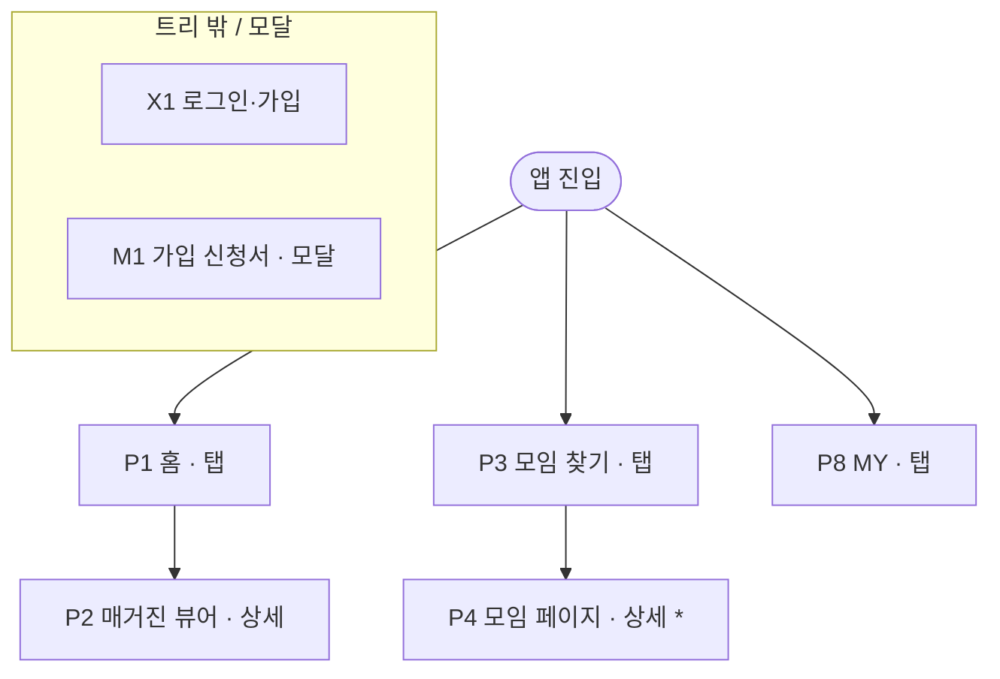

# 사이트맵 가이드 — 사이트맵이란 무엇이고 어떤 모양인가

discovery-sitemap 워크플로가 만드는 산출물의 정의서다. 워크플로(v1-sitemap-workflow.md)는
"어떤 순서로 만드는가"를, 이 문서는 "무엇을 만드는가"를 다룬다.

## 목적

사이트맵은 **서비스에 어떤 화면이 있고, 그것들이 어떻게 묶여 있는지를 한 장에 보여주는 지도**다.
정보 구조(IA)를 그림으로 옮긴 것이다.

이 한 장으로 하는 일:

```
1. 빠진 페이지와 겹치는 페이지를 찾는다
   기능 목록만 봐서는 "이 기능은 어느 화면에 있지?"가 보이지 않는다.
   예: 커뮤니티 탭이 홈 피드와 하는 일이 같다는 판단은 페이지를 나란히 놓아야 보인다.
2. 내비게이션을 정한다
   하단 탭을 몇 개로 할지, 무엇을 탭에 두고 무엇을 안쪽에 둘지가 트리의 1층에서 결정된다.
3. 작업량을 가늠한다
   페이지 수가 곧 디자인과 개발 분량이다.
4. 다음 단계의 목록이 된다
   유저 흐름은 이 페이지들 사이를 오가는 경로를 그리고,
   와이어프레임은 이 페이지들을 하나씩 그린다. 둘 다 사이트맵의 페이지 번호로 페이지를 가리킨다.
```

사이트맵이 다루지 않는 것:

```
순서 — 유저가 어떤 순서로 화면을 거치는지는 유저 흐름이 다룬다
배치 — 화면 안에서 무엇이 어디에 놓이는지는 와이어프레임이 다룬다
사이트맵은 포함 관계(이 페이지 아래에 저 페이지가 있다)와,
페이지마다 위에서 아래로 어떤 섹션이 쌓이는지까지만 다룬다.
```

## 모양

```
                        [앱 진입]
                            │
          ┌─────────────────┼─────────────────┐
        [홈]            [모임 찾기]           [MY]            ← 1층: 주 내비게이션 (하단 탭)
          │                 │                  │
     [매거진 뷰어]      [모임 페이지]*      [내 모임 목록]      ← 2층: 들어가서 보는 페이지
                            │                  │
                     [이벤트 상세]*       [운영 콘솔]
                            │
                    [참석 기록 작성]

  트리 밖 페이지:  [로그인·가입]  [온보딩]  [가입 신청서 (모달)]  [설정]  [검색 결과 없음]

  * 같은 틀로 여러 개 생기는 페이지 (모임마다 모임 페이지 하나)
```

### 구성 요소

| 요소 | 설명 |
|------|------|
| 뿌리 | 앱이나 사이트의 첫 진입점 |
| 1층 | 주 내비게이션. 앱이면 하단 탭, 웹이면 상단 메뉴. 1층끼리는 언제든 오갈 수 있다는 것이 전제다 |
| 2층 이하 | 들어가서 보는 페이지와 상세 페이지 |
| 트리 밖 페이지 | 특정 부모 없이 어디서든 불려 나오는 페이지. 로그인, 가입, 온보딩, 설정, 모달, 오류 화면 |
| 페이지 칸 | 페이지 번호 + 이름 + 유형. 섹션 목록은 칸 안이 아니라 별도 표로 적는다 |
| 선 | 부모와 자식을 잇는 포함 관계. 부모에서 자식으로 들어가는 기본 이동 경로이기도 하다 |

### 페이지 유형

앱에서는 페이지가 어떤 방식으로 열리는지가 화면 전환과 뒤로 가기 동작을 정한다. 페이지마다 하나를 붙인다.

| 유형 | 뜻 |
|------|-----|
| 탭 | 1층 내비게이션의 첫 화면 |
| 상세 | 다른 페이지에서 밀고 들어가는 화면. 뒤로 가기로 돌아간다 |
| 모달 | 현재 화면 위에 덮여 열리고, 닫으면 원래 화면으로 돌아간다. 바텀시트 포함 |
| 트리 밖 | 특정 부모 없이 여러 곳에서 불려 나오는 페이지 |

웹 서비스만 만든다면 "탭"을 "메뉴"로 읽는다.

## 사이트맵에 딸린 두 개의 표

트리 그림만으로는 부족한 정보를 두 표로 보완한다.

### 페이지별 섹션 목록

페이지 하나를 위에서 아래로 훑었을 때 나오는 덩어리(섹션)를 순서대로 적은 목록이다.
줄글로 "상단에는 ~, 중단에는 ~"라고 쓰는 대신 번호 붙은 목록으로 쓴다.

```
P4 모임 페이지 (상세, 템플릿)
  1. 헤더        [공통] — 뒤로가기, 공유
  2. 모임 정보    — 이름, 소개, 지역, 멤버 수, 가입 조건        (기능 6)
  3. 행동 버튼    — 팔로우, 가입 신청                         (기능 4, 11)
  4. 탭 바        — 아카이브(기본) · 이벤트 · 게시판 · 멤버
  5. 탭 내용      — 아카이브: 매거진 카드 목록                  (기능 7)
```

목록으로 쓰면 달라지는 점:
- 빠진 섹션이 보인다. 줄글에서는 헤더나 하단 탭이 언급되지 않아도 눈에 띄지 않는다.
- 다음 단계가 그대로 쓴다. 와이어프레임은 이 목록을 박스로 쌓고, 공통 컴포넌트는 여러 페이지에 반복되는 섹션을 모아 뽑는다.
- 고치기 쉽다. "P4의 3번 섹션을 위로" 처럼 번호로 수정을 주고받는다.

### 이동 표

트리의 선은 부모에서 자식으로 가는 이동만 보여준다. 트리의 가지를 가로지르는 이동
(예: 홈의 매거진 뷰어에서 모임 찾기 아래의 모임 페이지로)은 그림에 그리지 않는다 —
다 그리면 선이 엉켜 사람이 판단할 수 없게 된다. 이런 이동은 페이지마다 표로 적는다.

| 페이지 | 들어오는 곳 | 나가는 곳 |
|--------|------------|----------|
| P4 모임 페이지 | P3 모임 찾기, P2 매거진 뷰어, P1 홈 피드 카드, P9 내 모임 목록 | P5 이벤트 상세, P2 매거진 뷰어, M1 가입 신청서, X1 로그인 |

이 표로 할 수 있는 것:
- 들어오는 곳이 비어 있는 페이지, 즉 어디에서도 갈 수 없는 페이지를 찾는다.
- 유저 흐름 단계의 재료가 된다. 흐름에 쓰인 이동이 표에 없으면 표를 고치고,
  표에 있는데 어떤 흐름에도 쓰이지 않는 이동은 필요한지 다시 본다.

## 번호 규칙

```
페이지: P1, P2 … (트리 안), M1, M2 … (모달), X1, X2 … (트리 밖)
섹션:   P4-3 (P4 페이지의 3번 섹션)
기능:   ui-spec의 번호를 그대로 쓴다 (핵심 1~N, 보조 s1~sN). 새로 매기지 않는다.
한 번 붙인 번호는 페이지가 삭제되어도 재사용하지 않는다 — 삭제는 취소선으로 남긴다.
```

## 그릴 때 지키는 규칙

```
- 페이지를 가로지르는 이동은 트리 그림에 그리지 않는다 (이동 표에만 적는다)
- 같은 틀로 여러 개 생기는 페이지는 템플릿 하나로 그린다 (예: 모임 페이지 — 모임마다 하나)
- 한 페이지에는 목적 하나만 둔다. 목적을 한 줄로 쓸 수 없으면 페이지를 나눈다
- 핵심 기능은 3층보다 깊이 두지 않는다. 깊이 묻힌 기능은 찾기 어렵다
- 1층은 3~5개. 벗어나면 이유를 결정 기록에 남긴다
```

## 표현 형식

트리 그림은 mermaid `flowchart TD`로 쓴다. 트리 밖 페이지와 모달은 별도 subgraph로 묶는다.


