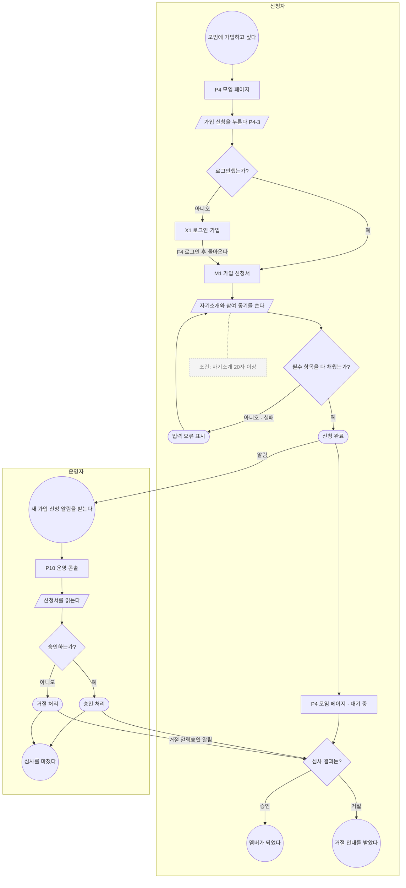

# 유저 흐름 가이드 — 유저 흐름이란 무엇이고 어떤 모양인가

discovery-user-flow 워크플로가 만드는 산출물의 정의서다. 워크플로(v1-user-flow-workflow.md)는
"어떤 순서로 만드는가"를, 이 문서는 "무엇을 만드는가"를 다룬다.

## 목적

유저 흐름은 **유저가 과업 하나를 하는 동안 어떤 화면을 어떤 순서로 거치고, 각 화면에서 무엇을 하는지를
시작부터 목표까지 그린 그림**이다. 과업이란 유저가 서비스에 와서 끝내려는 일 하나다
(예: 관심 있는 모임에 가입 신청하기, 다녀온 이벤트의 참석 기록 남기기).

사이트맵은 어떤 페이지가 있고 어떻게 묶이는지를 보여주지만, 유저가 그 페이지들을 어떤 순서로 지나가는지는 보여주지 않는다.
사이트맵의 이동 표는 "이 페이지에서 저 페이지로 갈 수 있다"만 적고, 그 이동이 어떤 과업의 몇 번째 걸음인지는 적지 않는다.
유저 흐름은 과업 하나를 골라 그 순서를 그린다. 이때 트리의 가지를 가로지르는 이동도 순서 안에 함께 그린다.

이 흐름 그림들로 하는 일:

```
1. 과업이 끝까지 이어지는지 확인한다
   페이지가 모두 있어도, 과업 도중에 다음으로 갈 버튼이나 이동이 없으면 유저는 거기서 멈춘다.
   예: 이벤트 상세에서 참석 기록을 쓰려는데, 이벤트가 끝난 뒤에는 이벤트 상세로 돌아올 길이 없다.
2. 실패하는 경우를 미리 찾는다
   입력이 틀렸을 때, 로그인하지 않았을 때, 결과가 하나도 없을 때처럼 성공 경로에서 벗어나는 경우를
   흐름마다 그려 두면, 그 경우에 보여줄 화면이 필요하다는 것이 개발 전에 드러난다.
3. 사이트맵에서 빠진 화면과 이동을 찾는다
   흐름을 그리다 나온 화면이 사이트맵에 없으면 사이트맵에 추가할 후보가 된다.
   흐름에 쓴 이동이 이동 표에 없으면 이동 표에 추가할 후보가 된다.
   이 후보들은 유저가 확인한 뒤 사이트맵 단계로 돌아가 반영한다.
4. 와이어프레임에 그릴 화면 상태의 목록을 만든다
   같은 페이지라도 비로그인일 때, 목록이 비어 있을 때, 오류가 났을 때, 불러오는 중일 때 모양이 다르다.
   흐름에서 나온 이런 상태를 목록으로 모아 와이어프레임 단계에 넘긴다.
```

유저 흐름이 다루지 않는 것:

```
포함 관계 — 어떤 페이지가 어느 페이지 아래에 있는지는 사이트맵이 다룬다
모든 이동의 목록 — 페이지 사이의 이동 전체는 사이트맵의 이동 표가 다룬다.
  유저 흐름은 과업 하나에 쓰이는 이동만 순서대로 그린다
배치 — 화면 안에서 버튼과 목록이 어디에 놓이는지는 와이어프레임이 다룬다.
  유저 흐름은 "P4 모임 페이지에서 가입 신청을 누른다"까지만 적고, 그 버튼의 위치는 적지 않는다
시스템 내부 처리 — 서버가 어떤 순서로 무엇을 처리하는지는 그리지 않는다.
  유저가 보게 되는 결과(성공했다 / 실패했다)만 그린다
```

세 산출물의 경계를 한 줄씩 정리하면 이렇다.

| 산출물 | 답하는 질문 |
|--------|-----------|
| 사이트맵 | 어떤 페이지가 있고, 어떻게 묶여 있고, 각 페이지에 어떤 섹션이 위에서 아래로 쌓이는가 |
| 유저 흐름 | 과업 하나를 하는 동안 어떤 화면을 어떤 순서로 거치고, 어디서 갈라지고, 실패하면 어디로 가는가 |
| 와이어프레임 | 화면 하나 안에서 섹션과 요소가 어디에 어떤 크기로 놓이는가 |

## 모양

흐름 하나는 시작점 하나에서 출발해 목표에 도착하는 그림이다. 중간에 갈림길이 있고, 실패한 경우는
다시 시도하는 자리로 되돌아가거나 따로 끝난다.

```
 ((모임에 가입하고 싶다))                                      ← 시작: 유저가 무엇을 하려고 들어오는가
          │
 [P4 모임 페이지]                                              ← 화면: 사이트맵 페이지 번호로 가리킨다
          │
 /가입 신청을 누른다/                                          ← 유저 입력: 누르기, 쓰기, 고르기
          │
    <로그인했는가?> ── 아니오 ──▶ [X1 로그인·가입] ▶ ([로그인 성공]) ┐
          │ 예                                                      │
          ◀─────────────────────────────────────────────────────────┘
 [M1 가입 신청서]
          │
 /자기소개와 참여 동기를 쓴다/ ··· 조건: 자기소개 20자 이상          ← 주석: 조건과 제한
          │
    <필수 항목을 다 채웠는가?> ── 아니오 · 실패 ──▶ ([입력 오류 표시]) ──▶ 쓰기 단계로 되돌아간다
          │ 예
    ([신청 완료])                                                  ← 시스템 결과: 성공 / 실패
          │
 [P4 모임 페이지 · 대기 중] ··· 운영자가 심사하면 알림으로 결과를 받는다
          │
 ((멤버가 되었다))                                                 ← 목표: 과업이 끝난 상태
```

이 그림은 신청자 한 사람 쪽만 줄여 그린 것이다. 괄호는 도형을 뜻한다:
((…))는 시작·목표 원, […]는 화면·단계, /…/는 유저 입력, <…?>는 분기, ([…])는 시스템 결과다.
운영자 쪽까지 그린 전체 모양은 아래 "예시"의 F1에 있다.

### 구성 요소

study 레퍼런스(`study/user_flow/`)의 여섯 흐름이 공통으로 쓰는 도형을 그대로 가져온다.

| 요소 | 도형 | 뜻 |
|------|------|-----|
| 시작 | 원 | 유저가 이 흐름에 들어오는 지점. "누가, 무엇을 하려고"를 적는다 |
| 목표 | 원 | 과업이 끝난 상태. 흐름마다 하나 이상 있다. 실패해서 끝나는 지점도 원으로 그리고 실패라고 적는다 |
| 화면 | 사각형 | 유저가 보고 있는 페이지. 사이트맵 페이지 번호를 붙인다 |
| 단계 | 사각형 | 화면은 아니지만 유저가 거치는 한 걸음 (예: 인증 메일 기다리기) |
| 유저 입력 | 평행사변형 | 유저가 하는 행동. 누르기, 쓰기, 고르기, 올리기 |
| 분기 | 마름모 | 조건에 따라 길이 갈리는 지점. 질문 형태로 쓰고, 나가는 선마다 답(예 / 아니오)을 붙인다 |
| 시스템 결과 | 알약 | 유저 행동에 서비스가 돌려준 결과. 성공과 실패를 따로 그린다 |
| 외부 서비스 | 물결 사각형 | 서비스 밖으로 나갔다 오는 지점 (예: 결제창, 소셜 로그인, 메일, 메신저 공유. 앱이면 카메라·지도 앱도) |
| 주석 | 회색 글자 | 단계나 분기에 붙는 조건과 제한 (예: 사진 20MB 이하, 비밀번호 5회 틀리면 잠김) |
| 선 | 화살표 | 다음 걸음. 실패 경로의 선에는 실패라고 표시한다 |

study 레퍼런스에서 도형 외에 함께 가져오는 표기:

```
선의 성공·실패 표시  레퍼런스는 분기에서 나가는 선에 초록 체크와 빨간 금지 표시를 붙인다.
                    우리는 선 라벨로 대신한다: 분기 선에는 답(예 / 아니오)을, 실패 경로의 선에는 "실패"를 함께 적는다
되돌이 선            재시도는 새 노드를 만들지 않고, 다시 입력하는 기존 노드로 선을 되돌린다
                    (로그인의 비밀번호 재입력, 프로필 사진의 다시 고르기, 검색의 검색어 다시 입력)
합쳐지는 선          분기로 갈라진 두 길이 같은 다음 단계로 이어지면 노드를 복사하지 않고 선을 합친다
                    (주문 흐름의 로그인 / 계정 만들기가 배송 정보 입력으로 합쳐지는 모양)
건너뛸 수 있는 단계  유저가 하지 않고 넘어가도 되는 단계는 노드 글자 끝에 "(선택)"을 붙인다
                    (검색 흐름의 필터·정렬)
실패로 끝나는 목표    재시도로 돌아가지 않고 과업이 끝나는 실패는 목표 원으로 따로 그리고 글자에 실패 사유를 적는다
                    (추천 흐름의 "조건을 채우지 못해 혜택 없음")
주석의 조건 값        주석의 숫자(용량, 횟수, 글자 수)는 입력 문서에서 가져온다. 없으면 "조건 미정"으로 적는다.
                    레퍼런스의 숫자(20MB, 3~5회)를 그대로 옮기지 않는다
```

레퍼런스 중 로그인 흐름은 Success · Error를 원으로 그렸지만, 우리는 원을 시작과 목표에만 쓰고
시스템 결과는 모두 알약으로 그린다. 한 그림 안에서 원이 두 가지 뜻을 갖지 않게 하기 위해서다.

### 흐름을 이루는 경로

```
성공 경로   시작에서 목표까지 아무 문제 없이 가는 길. 흐름마다 먼저 그린다
분기 경로   조건에 따라 갈리는 길. 분기에서 나간 선은 양쪽 모두 어딘가에 도착해야 한다
실패 경로   입력이 틀리거나, 권한이 없거나, 결과가 없을 때 가는 길.
            다시 시도하는 자리로 되돌아가거나(재시도), 실패한 목표에서 끝난다
```

study 레퍼런스의 여섯 흐름은 모두 실패 경로를 그린다. 로그인은 비밀번호가 틀리면 다시 입력으로 돌아가고
정해진 횟수를 넘으면 비밀번호 찾기로 빠진다. 프로필 사진 변경은 파일이 너무 크면 오류 메시지를 보여주고
사진 고르기로 돌아간다. 검색은 결과가 없으면 검색어 입력으로 돌아간다. 실패 경로가 없는 흐름은 덜 그린 흐름이다.

### 두 사람이 주고받는 흐름

과업 하나에 두 사람이 번갈아 참여하는 경우가 있다 (예: 신청자가 가입 신청을 하면 운영자가 심사한다,
study 레퍼런스의 추천 흐름에서는 유저가 링크를 보내면 친구가 받아 가입한다).
이런 흐름은 사람마다 칸을 나눠 그리고, 한 사람의 행동이 다른 사람에게 넘어가는 지점(알림, 링크)을
칸 사이의 선으로 잇는다. 사람마다 자기 칸 안에서 시작과 목표를 갖는다.

### 화면 상태

같은 페이지라도 조건에 따라 다른 모양으로 보이는 경우를 화면 상태라고 한다.
흐름의 분기와 실패 경로에서 주로 나온다.

| 상태 | 언제 생기는가 | 예 |
|------|-------------|-----|
| 비로그인 | 로그인하지 않은 유저가 로그인이 필요한 행동에 닿았을 때 | P4 모임 페이지를 비로그인으로 볼 때 가입 신청 버튼이 로그인 안내로 바뀐다 |
| 빈 목록 | 보여줄 항목이 하나도 없을 때 | P9 내 모임 목록에 가입한 모임이 없다 |
| 결과 없음 | 검색이나 필터 결과가 없을 때 | P3 모임 찾기에서 검색어에 맞는 모임이 없다 |
| 오류 | 입력이 틀렸거나 요청이 실패했을 때 | M1 가입 신청서에서 필수 항목을 비우고 제출했다 |
| 불러오는 중 | 결과를 기다리는 동안 (올린 파일을 처리하는 동안 포함) | P2 매거진 뷰어가 사진을 불러오는 중이다 |
| 대기 중 | 과업이 끝나지 않고 다른 사람을 기다리는 동안 | P4 모임 페이지가 가입 신청 뒤 심사 대기로 보인다 |

상태 이름은 이 표의 여섯 가지 중 하나만 쓴다. 여섯 가지로 나눴을 때 어느 것인지 헷갈리면 가까운 것을 고르고,
구체적인 상황은 "언제 생기는가"에 적는다 (마감되어 신청할 수 없는 상세 화면 → 오류, 마감으로 신청할 수 없을 때).

흐름에서 나온 화면 상태는 모두 목록으로 모아 와이어프레임 단계에 넘긴다.
와이어프레임은 이 목록을 보고 페이지마다 기본 모양 외에 어떤 상태를 더 그릴지 정한다.

## 예시 — 모임 찾기·가입 웹사이트

모임을 찾아 가입하고, 이벤트에 참석하고, 참석 기록을 매거진으로 남기는 웹사이트다.
사이트맵 가이드의 예시와 같은 서비스다. 사이트맵 가이드 예시에 번호가 있는 페이지(P1 홈, P2 매거진 뷰어,
P3 모임 찾기, P4 모임 페이지, P8 마이페이지, M1 가입 신청서, X1 로그인·가입)는 그 번호를 그대로 쓰고,
예시에 번호가 없는 페이지는 이 문서에서 이어 붙였다 (P5 이벤트 상세, P6 참석 기록 작성, P9 내 모임 목록, P10 운영 콘솔).
seed-v2의 고객군은 "모임을 찾는 사람"과 "모임 운영자" 둘이라고 가정한다.
기능 번호와 F1의 주석 조건 값(자기소개 20자 이상)도 설명을 위해 이 서비스의 ui-spec에 그렇게 적혀 있다고 가정한 값이다.
실제 흐름에서는 입력 문서에 있는 번호와 값만 쓴다.

이 서비스에서 그릴 흐름의 예:

| 번호 | 흐름 | 누가 | 시작 | 목표 | 다루는 기능 | 가져온 틀 |
|------|------|------|------|------|-----------|---------|
| F1 | 모임 가입 신청과 심사 | 모임을 찾는 사람(신청자), 모임 운영자(심사자) | 신청자가 모임 페이지에서 가입하고 싶어진다 | 신청자는 멤버가 되거나 거절 안내를 받는다 | 11, 12 | 없음 |
| F2 | 이벤트 참석 신청 | 모임을 찾는 사람(멤버) | 멤버가 모임의 다가오는 이벤트를 본다 | 참석 신청이 완료되어 내 일정에 들어간다 | 8 | 신청·주문 — 결제 없음 |
| F3 | 참석 기록 작성 | 모임을 찾는 사람(참석한 멤버) | 이벤트가 끝나고 기록 작성 안내 메일을 받는다 | 참석 기록이 매거진으로 모임 아카이브에 올라간다 | 9, 7 | 없음 |
| F4 | 로그인·가입 | 모든 고객군 | 로그인이 필요한 행동을 누른다 | 로그인된 상태로 원래 하던 화면에 돌아온다 | s1 | 로그인·가입 — 이메일 인증 없음 |

"누가" 칸에는 seed-v2의 고객군 이름을 쓴다. 그 과업에서 맡는 역할이 따로 있으면 괄호로 덧붙이고,
로그인처럼 모든 고객군이 하는 흐름은 "모든 고객군"이라고 적는다.

F4 로그인·가입처럼 여러 서비스에 흔한 흐름은 기본 흐름 틀에서 가져와 이 서비스에 맞게 조정한다.
F2처럼 핵심 과업이 기본 흐름 틀과 모양이 겹치면 틀을 가져오고 "가져온 틀" 칸에 틀 이름을 적는다.
F1, F3처럼 맞는 틀이 없는 흐름은 처음부터 그린다.

F1을 그리면 이렇다 (두 사람이 주고받는 흐름이라 사람마다 칸을 나눴다).



A4 X1 로그인·가입 안의 단계는 F4에서 그리므로 F1에서는 화면 노드 하나로 두고, 선 라벨에 F4를 적었다.
A10 심사 대기 화면은 목표가 아니다. 신청자는 여기서 운영자의 심사를 기다리고, 결과 알림을 받아 목표로 간다.

A2의 P4-3은 가입 신청 버튼이 있는 섹션이다 (사이트맵 가이드 예시의 P4 3번 섹션 "행동 버튼").
A10의 "· 대기 중"은 페이지 이름 뒤에 화면 상태를 덧붙인 것이다 ("번호 규칙"). 상태 이름은 여섯 가지 중 하나만 쓰고,
"운영자 심사를 기다린다"는 구체적인 내용은 화면 상태 목록의 "언제 생기는가"에 적는다.

F1에서 나온 화면 상태: P4 비로그인(A3에서 아니오), P4 대기 중(A10 심사 대기), M1 오류(A8 입력 오류).
F1에서 나온 이동 중 사이트맵의 이동 표와 대조할 것: P4 → M1, P4 → X1, X1 → M1 (로그인 후 신청서로 돌아오기),
알림 → P10 (운영자가 알림을 눌러 운영 콘솔로 들어오기).
사이트맵 가이드 예시의 이동 표에는 P4 → M1과 P4 → X1이 있고, X1 → M1과 알림 → P10은 없으므로 이 둘을 이동 추가 후보로 올린다.
M1에서 신청을 마치고 P4로 돌아오는 것은 모달을 닫고 연 화면으로 돌아가는 이동이라 대조하지 않는다 ("그릴 때 지키는 규칙").

## 기본 흐름 틀

여러 서비스에 흔한 흐름은 처음부터 그리지 않고 아래 틀에서 시작한다. study 레퍼런스(`study/user_flow/`)의
여섯 흐름에서 경로 모양만 가져와 정리했다. 쓰는 방법:

```
- ui-spec 보조 기능에 해당 기능이 있을 때만 틀을 가져온다
- 틀의 [화면 이름]은 자리 표시다. 이 서비스의 사이트맵 페이지 번호로 바꾼다 ([로그인 화면] → X1 로그인·가입)
- 이 서비스에 없는 단계는 지우고, 지운 것을 흐름 목록의 "가져온 틀" 칸에 틀 이름 뒤에 적는다 (예: 로그인·가입 — 이메일 인증 없음)
- 틀의 실패 경로는 지우지 않는다. 지우려면 이 서비스에서 그 실패가 일어나지 않는 이유를 결정 기록에 적는다
- 틀에 "조건 미정"으로 적힌 값은 입력 문서에서 찾아 채우고, 없으면 그대로 두고 전체 확인에서 묻는다
- 흐름 목록의 "가져온 틀" 칸에는 아래 틀 이름을 그대로 적는다 (틀 없이 새로 그린 흐름은 "없음")
- 틀의 "화면 상태" 줄은 "[화면 이름] 상태 이름(언제 생기는가)" 모양이다. 상태 이름은 "화면 상태" 표의 여섯 가지 중 하나다.
  [화면 이름]을 페이지 번호로 바꾼 뒤 화면 상태 목록에 옮긴다
- 틀 안의 괄호는 도형을 뜻한다: ((…)) 시작·목표 원, […] 화면·단계, /…/ 유저 입력, <…?> 분기,
  ([…]) 시스템 결과, [[…]] 외부 서비스. mermaid로 옮길 때는 "표현 형식" 표를 따른다
```

### 로그인·가입 (레퍼런스: login.png)

```
시작   ((로그인이 필요한 행동을 누른다)) — 어느 화면에서 눌렀는지 기억해 둔다
성공   [로그인 화면] → /로그인·가입 중 고른다/ → 로그인: /계정 정보를 입력한다/ → ([로그인 성공])
       → ((로그인된 채로 원래 화면에 돌아왔다))
분기   <가입했는가?> 아니오 → [가입 화면] → /가입 정보를 입력한다/ → <인증되었는가?>
         예 → ([가입 완료]) → 로그인 성공과 같은 목표로 합친다
         아니오 · 실패 → ([인증 실패 안내]) → 인증 다시 받기로 되돌아간다
실패   <계정 정보가 맞는가?> 아니오 · 실패 → ([로그인 오류]) → 계정 정보 입력으로 되돌아간다
       주석: 틀린 횟수 제한 — 조건 미정
       제한을 넘으면 → [비밀번호 찾기] → /인증한다/ → ([비밀번호 재설정 완료]) → 계정 정보 입력으로 되돌아간다
화면 상태  로그인 화면 오류, 가입 화면 오류, 원래 화면 비로그인
조정할 것  소셜 로그인만 쓰면 비밀번호 입력과 비밀번호 찾기를 지우고 외부 서비스([[소셜 로그인]]) 노드로 바꾼다.
          로그인 뒤 돌아갈 원래 화면으로의 이동이 이동 표에 있는지 대조한다
```

### 온보딩 (레퍼런스: onboarding.png)

```
시작   ((처음 가입을 마쳤다))
성공   [온보딩 첫 화면] → /단계마다 정보를 고르거나 입력한다/ → [프로필 설정] → /프로필을 채운다/
       → ([온보딩 완료]) → ((홈에 도착했다))
분기   <이 단계를 건너뛰는가?> 예 → 다음 단계로 (건너뛸 수 있는 단계는 "(선택)"을 붙인다)
       <이미 온보딩을 마친 유저인가?> 예 → 온보딩 없이 바로 홈 목표로 (로그인만 한 유저)
실패   <필수 항목을 채웠는가?> 아니오 · 실패 → ([입력 오류 표시]) → 해당 단계 입력으로 되돌아간다
화면 상태  온보딩 첫 화면 오류, 홈 빈 목록(관심사 고르기를 건너뛰어 보여줄 추천 항목이 없을 때)
조정할 것  온보딩 단계 수와 내용은 ui-spec 기능에서 가져온다. 틀의 단계 이름을 그대로 쓰지 않는다
```

### 검색 (레퍼런스: specific_search.png)

```
시작   ((찾는 것이 있다))
성공   [검색 화면] → /검색어를 입력한다/ → [검색 결과] → /필터·정렬을 고른다 (선택)/ → /항목을 고른다/
       → [상세 화면] → ((찾던 항목에 도착했다))
분기   <결과가 있는가?> 아니오 → [검색 결과 · 결과 없음] → <대안 제안을 고르는가?>
         예 → 대안 결과로 → 항목 고르기로 합친다
         아니오 · 실패 → 검색어 입력으로 되돌아간다
       <찾던 항목인가?> 아니오 → 검색 결과로 되돌아간다
실패   결과 없음이 곧 실패 경로다. 검색어를 비우고 누른 경우도 입력으로 되돌린다
화면 상태  검색 결과 결과 없음, 검색 결과 불러오는 중
조정할 것  대안 제안(추천 검색어, 인기 항목)이 ui-spec 기능에 없으면 그 분기를 지우고 입력으로 되돌리는 선만 남긴다
```

### 신청·주문 (레퍼런스: ecommerce_order.png)

```
시작   ((항목을 신청하거나 사고 싶다))
성공   [목록] → /항목을 고른다/ → [상세] → /신청(담기)을 누른다/ → [신청서(주문서)]
       → /필요한 정보를 입력한다/ → /확인하고 제출한다/ → ([신청 완료]) → ((신청 완료 상태를 보고 있다))
분기   <로그인했는가?> 아니오 → 로그인·가입 틀로 → 로그인 뒤 신청서로 합친다
       결제가 있으면 → [[결제창]] → <결제되었는가?>
실패   <필수 항목을 채웠는가?> 아니오 · 실패 → ([입력 오류 표시]) → 입력으로 되돌아간다
       <신청할 수 있는가?> 아니오 · 실패 (마감, 정원 초과, 품절) → ([신청 불가 안내]) → 목록으로 되돌아간다
       결제 실패 → ([결제 실패]) → 결제 다시 시도로 되돌아간다
화면 상태  상세 비로그인, 상세 오류(마감·정원 초과로 신청할 수 없을 때), 신청서 오류,
          상세 대기 중(운영자 승인이 필요한 신청을 마친 뒤)
조정할 것  결제가 없는 서비스(무료 신청, 가입 신청)는 결제 단계를 지운다.
          이 틀은 핵심 과업과 겹치기 쉽다. 겹치면 틀을 가져오되 흐름 목록의 "가져온 틀" 칸에 틀 이름을 적는다
```

### 프로필 변경 (레퍼런스: change_profile.png)

```
시작   ((내 정보를 바꾸고 싶다))
성공   [프로필 화면] → /바꿀 항목을 고른다/ → /새 값을 입력하거나 파일을 고른다/ → [미리 보기]
       → /확인을 누른다/ → ([변경 완료]) → ((바뀐 프로필을 보고 있다))
분기   <사진을 새로 고르는가?> 예 → [[파일 선택 창]] (앱이면 [[카메라 앱]]) → 미리 보기로 합친다
       <미리 보기에서 취소하는가?> 예 → 프로필 화면으로 되돌아간다
실패   <파일이 조건에 맞는가?> 아니오 · 실패 → ([오류 메시지]) → 파일 고르기로 되돌아간다
       주석: 파일 크기·형식 제한 — 조건 미정
화면 상태  프로필 화면 오류, 미리 보기 불러오는 중(고른 사진을 올리는 동안)
조정할 것  바꿀 수 있는 항목은 ui-spec 기능에서 가져온다
```

### 초대·추천 (레퍼런스: online_referal.png — 두 사람이 주고받는 흐름)

```
사람 A (보내는 사람)
  시작   ((다른 사람을 초대하고 싶다))
  성공   [초대 화면] → /초대 링크를 만든다/ → [[메신저 공유]] → ([공유 완료]) → ((초대를 보냈다))
  넘겨주는 지점: 링크 → 사람 B의 시작
사람 B (받는 사람)
  시작   ((초대 링크를 받았다))
  성공   /링크를 연다/ → <가입했는가?> 아니오 → 로그인·가입 틀로 → [초대받은 화면]
         → <초대 조건을 채웠는가?> 예 → ([초대 반영]) → ((초대받은 곳에 들어왔다))
  실패   <초대 조건을 채웠는가?> 아니오 · 실패 → ((조건을 채우지 못해 초대가 반영되지 않았다))
         링크가 만료되었으면 → ([만료 안내]) → ((초대를 다시 받아야 한다))
  결과가 다시 사람 A에게 넘어가면(알림) 사람 A의 목표 옆에 이어 그린다
화면 상태  초대받은 화면 비로그인, 초대받은 화면 오류(링크가 만료되었을 때)
조정할 것  보상이 없는 초대(모임 초대, 공동 작업 초대)는 조건 분기를 가입·수락 여부로 바꾼다.
          링크 유효 기간은 조건 미정으로 둔다
```

## 번호 규칙

```
흐름:       F1, F2 … — 흐름 하나에 번호 하나. 두 사람이 주고받는 흐름도 번호는 하나다
흐름 안 노드: 화면 노드는 사이트맵 페이지 번호를 그대로 붙인다 (P4, M1, X1 …).
             노드 글자는 "번호 페이지 이름"이다. 사이트맵의 페이지 이름을 바꾸지 않고 그대로 쓴다.
             같은 페이지의 특정 상태를 가리키려면 이름 뒤에 " · 상태"를 덧붙인다 (P4 모임 페이지 · 대기 중).
             " · " 뒤에는 "화면 상태"의 여섯 가지 이름만 쓴다 (심사 대기, 링크 만료 같은 자유 글자 금지).
             화면이 아닌 노드(유저 입력, 분기, 시스템 결과, 단계)에는 페이지 번호를 붙이지 않는다.
             단, 유저 입력이 특정 섹션에서 일어나면 입력 글자 끝에 섹션 번호를 적는다
             (가입 신청을 누른다 P4-3 — P4의 3번 섹션에서 누른다)
화면 상태:   페이지 번호 뒤에 상태 이름을 붙인다 (P4 비로그인, P9 빈 목록)
사이트맵에 없는 화면: 흐름에 나왔지만 사이트맵에 없는 화면은 번호 없이 "(추가 후보) 이름"으로 적는다.
             번호는 사이트맵에 반영된 뒤 사이트맵 단계가 붙인다
기능:       ui-spec의 번호를 그대로 쓴다 (핵심 1~N, 보조 s1~sN). 새로 매기지 않는다
한 번 붙인 흐름 번호는 흐름이 삭제되어도 재사용하지 않는다 — 삭제는 취소선으로 남긴다.
```

## 그릴 때 지키는 규칙

```
- 흐름 하나에는 과업 하나만 둔다. 시작과 목표를 한 줄씩 쓸 수 없으면 흐름을 나눈다
- 성공 경로를 먼저 그리고, 분기와 실패 경로를 나중에 채운다
- 분기에서 나간 선은 양쪽 모두 어딘가에 도착해야 한다 (끝이 비어 있는 분기 0)
- 유저 입력 단계마다 실패하는 경우가 있는지 본다. 있으면 실패 경로를 그린다
- 모든 화면에서 빠져나갈 길이 있어야 한다 (다음 걸음, 뒤로 가기, 닫기 중 하나)
- 화면 노드는 사이트맵 페이지 번호로 가리킨다. 사이트맵에 없는 화면은 추가 후보로 표시한다
- 두 사람이 주고받는 흐름은 사람마다 칸을 나눠 그린다
- 서버 내부 처리는 그리지 않는다. 유저가 보게 되는 결과만 그린다
- 과업 도중에 다른 흐름을 거치면(예: 가입 신청 중 로그인) 그 흐름의 단계를 다시 그리지 않는다.
  그 흐름의 첫 화면 노드 하나로 두고, 돌아오는 선의 라벨에 흐름 번호를 적는다 (A4 -- F4 로그인 후 돌아온다 --> A5)
- 주석 노드는 선을 세는 대상이 아니다. "빠져나갈 수 없는 화면"과 "끝이 비어 있는 분기"를 셀 때 주석은 빼고 센다
```

이동 표와 대조할 때 따로 대조하지 않는 이동:

```
- 모달을 닫고 그 모달을 연 화면으로 돌아가는 이동 (사이트맵 가이드 "페이지 유형"의 모달 정의가 이미 정한 이동이다)
- 1층 메뉴끼리 오가는 이동 (사이트맵 가이드 "구성 요소"에서 1층끼리는 언제든 오갈 수 있다고 전제한다)
- 뒤로 가기로 바로 앞 화면에 돌아가는 이동 (이동 표에 있는 이동을 거꾸로 가는 것이다)
이 세 가지를 뺀 나머지 이동은 모두 이동 표와 대조한다. 알림, 외부 링크, 공유 링크로 들어오는 이동도
이동 표의 "들어오는 곳"에 적혀 있어야 한다 (예: 알림 → P10 운영 콘솔).
```

## 표현 형식

흐름마다 mermaid `flowchart` 하나로 쓴다. 가로로 긴 흐름은 `LR`, 분기가 많은 흐름은 `TD`를 쓴다.
도형은 아래처럼 대응시킨다.

| 요소 | mermaid 문법 | 예 |
|------|------------|-----|
| 시작 · 목표 | `((…))` 원 | `A0((모임에 가입하고 싶다))` |
| 화면 · 단계 | `[…]` 사각형 | `A1[P4 모임 페이지]` |
| 유저 입력 | `[/…/]` 평행사변형 | `A2[/가입 신청을 누른다/]` |
| 분기 | `{…}` 마름모 | `A3{로그인했는가?}` |
| 시스템 결과 | `([…])` 알약 | `A9([신청 완료])` |
| 외부 서비스 | `[[…]]` 이중 사각형 (mermaid 기본 문법에 물결 사각형이 없어 대신 쓴다) | `C1[[결제창]]` |
| 주석 | 회색 `note` 클래스 노드를 점선(`-.-`)으로 붙인다 | `A6 -.- N1` |
| 두 사람 | 사람마다 `subgraph` | `subgraph A[신청자]` |
| 선의 답 · 실패 표시 | 선 라벨 | `A7 -- 아니오 · 실패 --> A8` |

노드 글자에 괄호가 들어가면 글자 전체를 따옴표로 감싼다 (`A8[/"카테고리를 고른다 P3-2 (선택)"/]`,
`N1["조건: 자기소개 20자 이상 (공백 제외)"]:::note`). 감싸지 않으면 mermaid가 괄호를 도형 문법으로 읽어 그림이 깨진다.

노드 id는 흐름 안에서만 쓰는 임시 이름이다 (A0, B1 …). 사람이 읽는 번호는 노드 글자 안의
페이지 번호(P4, M1 …)다.
