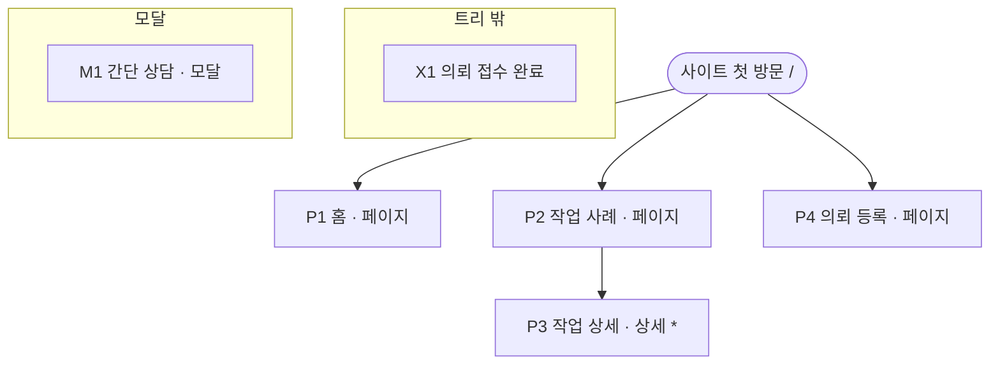

# 사이트맵 — 1인 외주 개발사가 작업 사례를 보여주고 프로젝트 의뢰를 받는 홍보 웹사이트

기준 문서: ui-spec/ui-spec.md · 플랫폼: 웹 · 진행 상태: 전체 확정

> 생성기 본보기용 가짜 run이다. 기능 번호와 섹션 구성은 설명을 위해 가정한 값이다.

## 서비스 용어

| 용어 | 뜻 |
|------|-----|
| 작업 사례 | 이전에 한 프로젝트 한 건 (문제, 접근, 결과를 담는다) |
| 의뢰 | 방문자가 만들고 싶은 서비스를 적어 남기는 정식 요청 |
| 간단 상담 | 의뢰가 부담스러운 방문자가 짧은 질문만 남기는 요청 |

## 트리

`*` = 같은 틀로 여러 개 생기는 템플릿 페이지. 1층(P1·P2·P4)은 상단 메뉴에 놓인다.

## 페이지 목록

| 번호 | 페이지 | 유형 | URL 경로 | 목적 한 줄 | 부모 | 담는 기능 |
|------|--------|------|---------|-----------|------|----------|
| P1 | 홈 | 페이지 | `/` | 무엇을 하는 개발자인지 보고 작업 사례나 의뢰로 넘어간다 | 뿌리 | 1, 3, 4, 5, 6, s1 |
| P2 | 작업 사례 | 페이지 | `/works` | 카테고리별로 이전 작업을 훑어본다 | 뿌리 | 1, 3, 4, s1 |
| P3 | 작업 상세 | 상세 (템플릿 — 작업마다) | `/works/{작업 이름}` | 작업 한 건의 문제·접근·결과를 읽고 의뢰를 정한다 | P2 | 1, 2, 3, 4, s1 |
| P4 | 의뢰 등록 | 페이지 | `/request` | 아는 만큼만 단계별로 적어 의뢰를 남긴다 | 뿌리 | 3, 4, s1 |
| X1 | 의뢰 접수 완료 | 트리 밖 | `/request/done` | 의뢰가 접수된 것과 답변 받는 방법을 확인한다 | — | 3 |
| M1 | 간단 상담 | 모달 | — (연 페이지 주소 그대로) | 이름·연락 방법·질문만 적어 짧게 묻는다 | — | 4 |

## 공통 섹션

| 섹션 | 담는 내용 | 쓰이는 페이지 |
|------|----------|--------------|
| 상단 메뉴 | 로고(→ P1), 작업 사례 · 의뢰 등록 메뉴, 간단 상담 버튼(→ M1) | P1, P2, P3, P4, X1 |
| 푸터 | 소개 한 줄, 연락처(이메일 · 카카오톡), 메뉴 링크 (기능 s1) | P1, P2, P3, P4, X1 |

## 페이지별 섹션 목록

### P1 홈 (페이지)
1. 상단 메뉴 [공통]
2. 히어로 — 하는 일 한 줄, 대상 고객 설명, 프로젝트 등록하기(→ P4) · 작업 사례 보기(→ P2) · 간단히 문의하기(→ M1) 버튼, 대표 이미지 (기능 6)
3. 이런 경우 문의 — 문의하면 좋은 상황 여섯 줄 (기능 6)
4. 제공 업무 — MVP 제작 · AI / 챗봇 · 검색 / 추천 · 기술 컨설팅 네 묶음, 묶음마다 제목과 짧은 목록 (기능 6)
5. 숫자로 보는 경력 — 숫자 다섯 개와 숫자마다 설명 한 줄 (기능 5)
6. 대표 작업 — 작업 카드 세 개(대표 이미지, 카테고리, 제목, 한 줄 설명, 역할), 전체 보기(→ P2) (기능 1)
7. 프로젝트 등록 안내 — 요구사항이 정리되지 않아도 된다는 안내, 프로젝트 등록하기(→ P4) (기능 3)
8. 푸터 [공통]

### P2 작업 사례 (페이지)
1. 상단 메뉴 [공통]
2. 페이지 제목 — 제목, 설명 한 줄
3. 카테고리 필터 — 전체 · MVP · AI · 검색 / 추천 · 컨설팅 (기능 1)
4. 작업 카드 목록 — 작업 카드(대표 이미지, 카테고리, 제목, 한 줄 설명, 역할) 세 열, 누르면 P3 (기능 1)
5. 의뢰 안내 — 안내 한 줄, 프로젝트 등록하기(→ P4), 간단히 문의하기(→ M1) (기능 3, 4)
6. 푸터 [공통]

### P3 작업 상세 (상세, 템플릿 — 작업마다)
1. 상단 메뉴 [공통]
2. 작업 머리 — 카테고리, 제목, 설명 한 줄, 대표 이미지 (기능 2)
3. 프로젝트 정보 — 카테고리 · 역할 · 연도, 담당 범위 (기능 2)
4. 본문 — 문제, 요구사항, 접근, 구조 그림, 선택 이유, 결과 (기능 2)
5. 비슷한 의뢰 안내 — 프로젝트 등록하기(→ P4), 간단히 문의하기(→ M1) (기능 3, 4)
6. 다른 작업 — 작업 카드 세 개 (기능 1)
7. 푸터 [공통]

### P4 의뢰 등록 (페이지)
1. 상단 메뉴 [공통]
2. 페이지 제목 — 제목, 요구사항이 정리되지 않아도 된다는 안내 (기능 3)
3. 단계 표시 — 기본 정보 · 현재 단계 · 필요한 도움 · 일정과 예산 · 연락처 · 추가 내용 (기능 3)
4. 입력 폼 — 지금 단계의 입력 칸. 1단계는 프로젝트 이름, 서비스 한 줄 설명, 참고 URL (기능 3)
5. 단계 이동 버튼 — 이전, 다음. 마지막 단계에서는 의뢰 등록 (기능 3)
6. 간단 상담 안내 — 정식 등록이 부담스러우면 간단히 문의하기(→ M1) (기능 4)
7. 푸터 [공통]

### X1 의뢰 접수 완료 (트리 밖)
1. 상단 메뉴 [공통]
2. 접수 완료 안내 — 접수 완료 문구, 답변 받는 방법 안내 (기능 3)
3. 다음 행동 — 작업 사례 보기(→ P2), 홈으로(→ P1)
4. 푸터 [공통]

### M1 간단 상담 (모달)
1. 모달 머리 — 제목, 닫기 버튼
2. 질문 입력 — 이름, 연락 방법, 질문 (기능 4)
3. 보내기 버튼 (기능 4)

## 이동 표

| 페이지 | 들어오는 곳 | 나가는 곳 |
|--------|------------|----------|
| P1 홈 | 뿌리(주소 /), 상단 메뉴 로고, X1(홈으로) | P2(작업 사례 보기, 전체 보기), P3(대표 작업 카드), P4(프로젝트 등록하기), M1(간단히 문의하기, 상단 메뉴 간단 상담) |
| P2 작업 사례 | 뿌리, 상단 메뉴, P1(작업 사례 보기, 전체 보기), X1(작업 사례 보기) | P3(작업 카드), P4(프로젝트 등록하기), M1(간단히 문의하기) |
| P3 작업 상세 | P2(작업 카드), P1(대표 작업 카드), P3(다른 작업), 외부 링크(작업 주소를 직접 연다) | P4(프로젝트 등록하기), M1(간단히 문의하기), P3(다른 작업), 뒤로 |
| P4 의뢰 등록 | 뿌리, 상단 메뉴, P1·P2·P3(프로젝트 등록하기) | X1(의뢰 등록 후), M1(간단히 문의하기) |
| X1 의뢰 접수 완료 | P4(의뢰 등록을 마침) | P2(작업 사례 보기), P1(홈으로) |
| M1 간단 상담 | 간단히 문의하기를 누름 — P1-2, P2-5, P3-5, P4-6, 상단 메뉴 간단 상담 버튼 | 보내기·닫기 후 원래 페이지 |

## 점검 결과 (7단계)

| 영역 | 항목 | 결과 |
|------|------|------|
| 기능 배치 | 모든 기능이 섹션에 들어감 | 통과 |

## 결정 기록

| 단계 | 무엇을 | 유저 답변 원문 |
|------|--------|---------------|
| 0 | 플랫폼 | 본보기용 가정 — 웹 |
