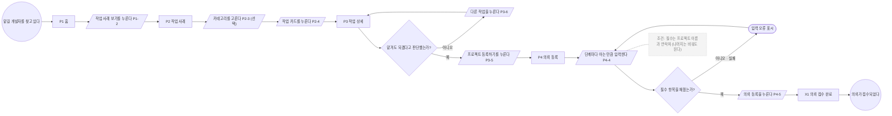
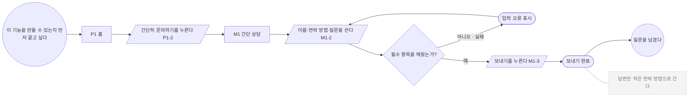

# 유저 흐름 — 1인 외주 개발사가 작업 사례를 보여주고 프로젝트 의뢰를 받는 홍보 웹사이트

기준 문서: sitemap/sitemap.md · ui-spec/ui-spec.md · value-proposal/seed-v2.md
진행 상태: 전체 확정

> 생성기 본보기용 가짜 run이다. 흐름 두 개만 그렸다.

## 흐름 목록

| 번호 | 흐름 | 누가 | 시작 | 목표 | 다루는 기능 | 가져온 틀 |
|------|------|------|------|------|-----------|---------|
| F1 | 작업 사례를 보고 의뢰 등록하기 | 개발자를 찾는 예비 창업자 | 홈에서 무엇을 하는 개발자인지 본다 | 의뢰가 접수되었다 | 1, 2, 3 | 신청·주문 — 결제 없음 |
| F2 | 간단 상담 남기기 | 개발자를 찾는 예비 창업자 | 정식 의뢰 전에 짧게 묻고 싶다 | 질문을 남겼다 | 4 | 없음 |

어느 흐름에도 들어가지 않은 핵심 기능: 없음

## 흐름별 그림

### F1 작업 사례를 보고 의뢰 등록하기
- 누가: 개발자를 찾는 예비 창업자
- 시작: 홈에서 무엇을 하는 개발자인지 본다
- 목표: 의뢰가 접수되었다
- 다루는 기능: 1, 2, 3

- 이 흐름에서 나온 화면 상태: P4 오류
- 이 흐름에서 나온 사이트맵 추가 후보: 없음

### F2 간단 상담 남기기
- 누가: 개발자를 찾는 예비 창업자
- 시작: 정식 의뢰 전에 짧게 묻고 싶다
- 목표: 질문을 남겼다
- 다루는 기능: 4

- 이 흐름에서 나온 화면 상태: M1 오류
- 이 흐름에서 나온 사이트맵 추가 후보: 없음

## 화면 상태 목록

| 페이지 | 상태 | 언제 생기는가 | 나온 흐름 |
|--------|------|-------------|----------|
| P4 의뢰 등록 | 오류 | 필수 항목(프로젝트 이름, 연락처)을 비우고 다음이나 의뢰 등록을 누를 때 | F1 (A13) |
| M1 간단 상담 | 오류 | 이름·연락 방법·질문 중 하나를 비우고 보내기를 누를 때 | F2 (A6) |

## 사이트맵 대조 결과

| 구분 | 내용 | 나온 흐름 | 반영 방법 | 유저 결정 | 반영 결과 |
|------|------|----------|----------|----------|----------|
| — | 없음 | — | — | — | — |

어느 흐름에도 쓰이지 않은 이동: 없음

## 결정 기록

| 단계 | 무엇을 | 유저 답변 원문 |
|------|--------|---------------|
| 2 | 흐름 목록 | 본보기용 가정 |
